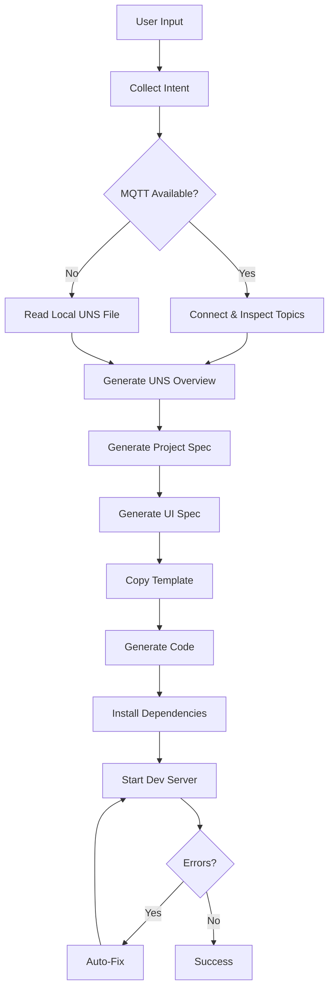

# UNS App CLI

A powerful CLI tool for generating industrial UNS/MQTT applications using AI-driven code generation.

## Features

- 🤖 AI-powered application generation using Claude API
- 🏭 Industrial-focused with UNS (Unified Namespace) support
- 📡 MQTT integration for real-time data streaming
- 🎨 Auto-generated UI based on requirements
- 🔧 Self-healing code with automatic error detection and fixes
- 📊 Built-in data visualization capabilities
- 🚀 Production-ready React/TypeScript applications

## Prerequisites

- Node.js >= 18.0.0
- npm or pnpm
- Anthropic API key

## Installation

```bash
# Clone the repository
git clone <repository-url>
cd uns-app-cli

# Install dependencies
npm install

# Make CLI executable
chmod +x bin/uns-app.mjs

# Link globally (optional)
npm link
```

## Configuration

1. Copy the environment template:
```bash
cp .env.example .env
```

2. Configure your environment variables:
```env
# Required
ANTHROPIC_API_KEY=your_api_key_here

# Optional MQTT Configuration
MQTT_BROKER_URL=wss://broker.example.com
MQTT_USERNAME=your_username
MQTT_PASSWORD=your_password

# Optional Template Directory
TEMPLATE_DIR=./templates/webapp-template
```

## Usage

### Start the Generation Wizard

```bash
npx uns-app init
# or if linked globally
uns-app init
```

This will guide you through:
1. Describing your application requirements
2. Connecting to MQTT broker or using local UNS data
3. Generating project specifications
4. Creating UI specifications
5. Generating application code
6. Running tests and applying fixes

### Other Commands

```bash
# Inspect UNS topics only
uns-app inspect

# Generate code from existing specifications
uns-app build

# Test and fix an existing application
uns-app test --path ./apps/your-app
```

## Workflow



## Generated Application Structure

The CLI generates a complete React application with:

```
apps/
└── <app-name>/
    ├── src/
    │   ├── components/      # UI components
    │   ├── mqtt/            # MQTT client and provider
    │   ├── pages/           # Application pages
    │   ├── store/           # State management
    │   └── App.tsx          # Main application
    ├── package.json         # Dependencies
    ├── tsconfig.json        # TypeScript config
    └── vite.config.ts       # Build configuration
```

## Artifacts

All generation artifacts are saved in the `artifacts/` directory:

- `intent.json` - Parsed user requirements
- `uns_overview.md` - UNS topics documentation
- `project_spec.md` - Detailed project specification
- `UI_spec.md` - UI/UX specification
- `code_tree.md` - Generated file structure
- `test_report.md` - Test execution results
- `fixes.md` - Applied auto-fixes

## Error Handling

The CLI includes intelligent error recovery:

1. **Compilation Errors**: Automatically detected and fixed
2. **Runtime Errors**: Captured and patched
3. **Dependency Issues**: Resolved automatically
4. **MQTT Connection**: Graceful fallback to local data

## Development

### Running in Development Mode

```bash
npm run dev
```

### Building

```bash
npm run build
```

### Project Structure

```
uns-app-cli/
├── bin/                    # CLI entry point
├── src/
│   ├── cli.ts             # Command definitions
│   ├── config.ts          # Configuration
│   ├── ai/                # Claude API integration
│   ├── mqtt/              # MQTT inspection
│   ├── spec/              # Specification generators
│   ├── code/              # Code generation
│   ├── test/              # Test runner
│   └── utils/             # Utilities
├── templates/             # Application templates
└── artifacts/             # Generated outputs
```

## Troubleshooting

### Common Issues

1. **MQTT Connection Failed**
   - Verify broker URL and credentials
   - Check network connectivity
   - Falls back to local UNS file automatically

2. **API Rate Limits**
   - The CLI includes retry logic
   - Adjust temperature and max tokens if needed

3. **Build Errors**
   - Auto-fix will attempt 3 retries
   - Check `artifacts/test_report.md` for details

### Debug Mode

Set environment variable for verbose logging:
```bash
DEBUG=* npx uns-app init
```

## Security Considerations

- API keys are never included in generated code
- MQTT credentials are environment-specific
- Generated applications include error boundaries
- No mock data - all data from real sources

## Contributing

Contributions are welcome! Please:
1. Fork the repository
2. Create a feature branch
3. Add tests for new features
4. Submit a pull request

## License

MIT

## Support

For issues and questions:
- GitHub Issues: [Report bugs](https://github.com/your-org/uns-app-cli/issues)
- Documentation: Check the `artifacts/` directory for detailed specs